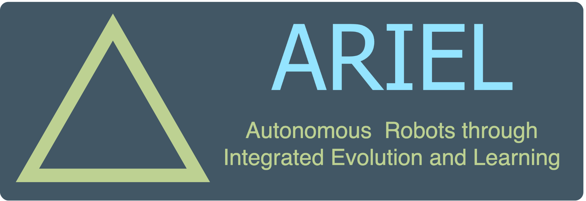
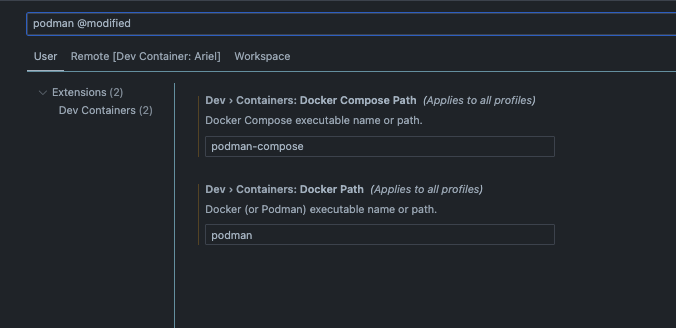

# ARIEL: Autonomous Robots through Integrated Evolution and Learning

## Requirements

* [vscode](https://code.visualstudio.com/)
  * [containers ext](https://marketplace.visualstudio.com/items?itemName=ms-vscode-remote.remote-containers)
  * [container tools ext](https://marketplace.visualstudio.com/items?itemName=ms-azuretools.vscode-containers)

* Container manager:
  * [podman desktop](https://podman.io/)
  * [docker desktop](https://www.docker.com/products/docker-desktop/)
  
* [vscode containers tut](https://code.visualstudio.com/docs/devcontainers/tutorial)

---
## Installation and Running

This project uses [uv](https://docs.astral.sh/uv/).

To run the code examples please do

```bash
uv venv
uv sync
uv run examples/0_render_single_frame.py
```

## TODO: Installation

## Notes

### This project is managed using `uv`

### Python Code Style Guide

This repository uses the `numpydoc` documentation standard.
For more information checkout: [numpydoc-style guide](https://numpydoc.readthedocs.io/en/latest/format.html#)

<!-- ### Units

To ensure that Ariel uses a consistent set of units for all simulations, we use [SI units](https://www.wikiwand.com/en/articles/International_System_of_Units), and (astropy)[https://docs.astropy.org/en/stable/index.html] to enforce it (we automatically convert where we can).

For more information, see: [astropy: units and quantities](https://docs.astropy.org/en/stable/units/index.html) and [astropy: standard units](https://docs.astropy.org/en/stable/units/standard_units.html#standard-units). -->

### MuJoCo

#### Attachments

Robot parts should be attached using the `site` functionality (from body to body), while robots should be added to a world using the `frame` functionality (from spec to spec).

- [Python → Attachment](https://mujoco.readthedocs.io/en/stable/python.html#attachment)
- [mjsFrame](https://mujoco.readthedocs.io/en/stable/APIreference/APItypes.html#mjsframe)

NOTE: when attaching a body, only the contents of `worldbody` get passed, meaning that, for example, `compiler` options are not!

---

## IMPORTANT!!

Change the default configuration of vscode dev containers to accept podman!

Either by the settings gui:




## Running the code

* In general you can run the currently open python script via the command palette (`cmd+shift+p`): 
  * `Tasks: Run Task` -> `Run script: uv run {$file}`

### Run GUI: 

* via terminal

```bash
uv run src/ariel/gui_code/litegraph/main.py
```

### Run EA Example

```bash
uv run src/ariel/ec/a004.py
```

### Run MuJoCo Example(s)a

Any from the `examples/` folder

For example (pun intended):

```bash
uv run examples/_hi_prob_dec.py
```

## Neat commands!

### Grab `requirements.tex` automatically
```bash
uv add tool pipreqs
pipreqs path/to/parse --mode no-pin --force
uv add -r requirements.txt
```


<!-- # Ariel

[][pypi status]
[][pypi status]
[][pypi status]
[][license]

[][read the docs]
[][tests]
[][codecov]

[][pre-commit]
[![Ruff codestyle][ruff badge]][ruff project]

[pypi status]: https://pypi.org/project/ariel/
[read the docs]: https://ariel.readthedocs.io/
[tests]: https://github.com/Jacopo-DM/ariel/actions?workflow=Tests
[codecov]: https://app.codecov.io/gh/Jacopo-DM/ariel
[pre-commit]: https://github.com/pre-commit/pre-commit
[ruff badge]: https://img.shields.io/endpoint?url=https://raw.githubusercontent.com/astral-sh/ruff/main/assets/badge/v2.json
[ruff project]: https://github.com/charliermarsh/ruff

## Features

- TODO

## Requirements

- TODO

## Installation

You can install _Ariel_ via [pip] from [PyPI]. The package is distributed as a pure Python package, but also with pre-compiled wheels for major platforms, which include performance optimizations.

```console
$ pip install ariel
```

The pre-compiled wheels are built using `mypyc` and will be used automatically if your platform is supported. You can check the files on PyPI to see the list of available wheels.

## Usage

Please see the [Command-line Reference] for details.

## Development

To contribute to this project, please see the [Contributor Guide].

### Mypyc Compilation

This project can be compiled with `mypyc` to produce a high-performance version of the package. The compilation is optional and is controlled by an environment variable.

To build and install the compiled version locally, you can use the `tests_compiled` nox session:

```console
$ nox -s tests_compiled
```

This will set the `ARIEL_COMPILE_MYPYC=1` environment variable, which triggers the compilation logic in `setup.py`. The compiled package will be installed in editable mode in a new virtual environment.

You can also build the compiled wheels for distribution using the `cibuildwheel` workflow, which is configured to run on releases. If you want to build the wheels locally, you can use `cibuildwheel` directly:

```console
$ pip install cibuildwheel
$ export ARIEL_COMPILE_MYPYC=1
$ cibuildwheel --output-dir wheelhouse
```

This will create the compiled wheels in the `wheelhouse` directory.

## Contributing

Contributions are very welcome.
To learn more, see the [Contributor Guide].

## License

Distributed under the terms of the [GPL 3.0 license][license],
_Ariel_ is free and open source software.

## Issues

If you encounter any problems,
please [file an issue] along with a detailed description.

## Credits

This project was generated from [@cjolowicz]'s [uv hypermodern python cookiecutter] template.

[@cjolowicz]: https://github.com/cjolowicz
[pypi]: https://pypi.org/
[uv hypermodern python cookiecutter]: https://github.com/bosd/cookiecutter-uv-hypermodern-python
[file an issue]: https://github.com/Jacopo-DM/ariel/issues
[pip]: https://pip.pypa.io/

<!-- github-only -->
<!-- 
[license]: https://github.com/Jacopo-DM/ariel/blob/main/LICENSE
[contributor guide]: https://github.com/Jacopo-DM/ariel/blob/main/CONTRIBUTING.md
[command-line reference]: https://ariel.readthedocs.io/en/latest/usage.html -
->
