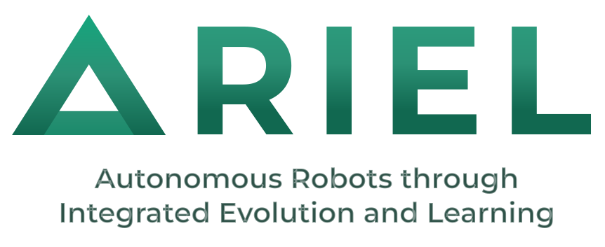

:layout: landing

# ARIEL - A Robot Evolution Framework




Ariel is a Python package, similar to Revolve, that provides efficient and easy-to-use tools for many aspects of evolutionary computing and evolutionary robotics.  
It is designed with a clear API, sensible defaults, and support for both beginners and advanced users.

---

## Features

| Feature                     | Description                                                                                                      |
| --------------------------- | ---------------------------------------------------------------------------------------------------------------- |
| **Easy to use GUI**         | Every aspect of the package from EC to ER can be configured and run through a user-friendly graphical interface. |
| **Evolutionary Algorithms** | Already implemented evolutionary operators.                                                                      |
| **Evolutionary Robotics**   | Tools for simulating and evolving robots in various environments.                                                |


Get started below, or explore the full documentation for more details.

---

## Installation Information

See the [installation guide](source/installation_guide.md) for more details.

---

## Contents

```{toctree}
:maxdepth: 3
:caption: Contents:

Introduction to modular robots <source/introduction_to_modular_robots/index>
Contributing guide <source/contributing_guide/index>
Installation Guide <source/installation_guide>
Evolutionary Computing Course Documentation <source/ec_course_docs>
GUI <source/GUI>
Your first EA with ARIEL <source/ea_intro/ea_example>
MuJoCo Data Variables Documentation <source/Mujoco_docs/mujoco_docs>
```
---

## License

Copyright (c) 2025, Ariel.  
All rights reserved.

---