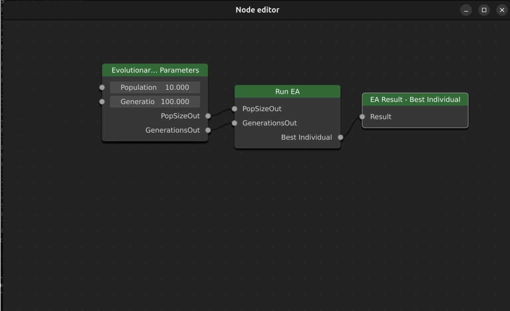

<!-- TODO:
Complete EC module section
update the GUI image
Running experiments with GUI
-->
# Evolutionary Computing Course Documentation

This section contains information more directed towards the use of ARIEL for the Evolutionary Computing course. Here you can find installation information, basic functions needed for the assignments, and tips on how some things are done using ARIEL.

## Run the example files
After following the normal ARIEL installation guide you can come here for the following steps. We highly recommend you use a virtual environment alongside uv, this will help significantly with requirement conflicts. 

### uv version
Things are a bit simpler if you are using uv. In your terminal simply run the following commands one by one:
```bash
uv venv
uv sync
uv run examples/0_render_single_frame.py 
```

These commands will automatically create the virtual environment, activate it, install all the requirements with their respective versions to avoid any conflicts and then run the example file. After you create the venv you can activate it again like you would with a normal one using:
```bash
Activate venv:
./.venv/Scripts/activate

Deactivate venv:
./.venv/Scripts/deactivate
```  

### Pip version
If you are using pip then you can create a normal virtual environment with: 
```bash
python -m venv C:/path/to/new/virtual/environment
```
or create it with the IDE you are using. For example, in VS Code just press `ctrl+shift+p` and select `Python: Create Environment`. Then run one of the example files in the examples module. For example `python examples/0_render_single_frame.py`, this file starts a simulation and takes a screenshot of a single frame of a red cube. 

It should look something like this: 


## Basic ARIEL Functions
In this section we will present some of the basic functionalities of ARIEL.

### EC Module
To make implementation easier, ARIEL has many built in evolutionary operators (much like [DEAP](https://deap.readthedocs.io/en/master/)) for you to use in your work. This happens via the EC module.

The functions of this module can be found under:
```python
import ariel.ec as ec
```

## Starting Guide
The starting guide intends to help you start your first ARIEL experiment. This can be done in two ways. By running the experiments manually from a python file or using the GUI [`HYPERLINK TO GUI PAGE ON THE DOCS`].

### Run Experiments Manually
To run an experiment manually you just need to define all the necessary parameters and run the file. Here is an example: 

```python
# Third-party libraries
import mujoco

# Local libraries
from ariel.environments.simple_flat_world import SimpleFlatWorld
from ariel.utils.renderers import single_frame_renderer


def main() -> None:
    """Entry point."""
    # World
    world = SimpleFlatWorld()

    # Object
    body = mujoco.MjSpec()
    cube = body.worldbody.add_body(name="cube")
    cube.add_geom(
        type=mujoco.mjtGeom.mjGEOM_BOX,
        size=(0.1, 0.1, 0.1),
        rgba=(0.8, 0.2, 0.2, 1.0),
    )

    # Add object to world
    world.spawn(body)

    # Generate the model and data
    model: mujoco.MjModel = world.spec.compile()
    data = mujoco.MjData(model)

    # Render a single frame
    single_frame_renderer(model, data, steps=10_000)
```

## Currently work in progress and thus not usable.
### Run Experiments Using the GUI
For a more detailed explanation on how the GUI works and how to use it check out the {doc}`GUI`.

The way the GUI works is in the form of a "Node Editor". This allows you to highly customize your experiments without needing ot write code. As you can see in the example (although simplified), you can create nodes with your parameters (population size, generations etc) and evolutionary operators (crossover, mutation etc) and link them to create the complete evolutionary process.


