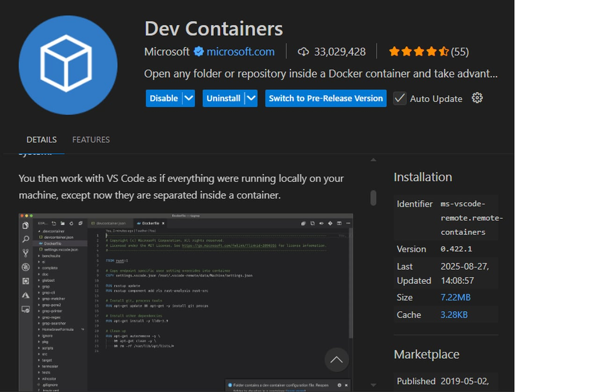
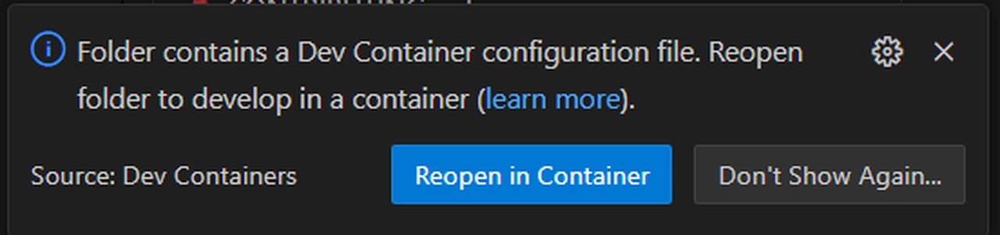

<!-- TODO:
1. check docker section
2. add images to docker section -->
# Installation guide

## Prerequisites

- Python 3.12 or newer
- [uv](https://github.com/astral-sh/uv) package manager
- [pip](https://pip.pypa.io/en/stable/)
- [dev containers VScode extension](https://code.visualstudio.com/docs/devcontainers/containers)

## Picking the right installation method
ARIEL contains and requires many other libraries to function properly, and avoiding conflicts between them is hard even with set versions in the `requirements.txt` file. For this reason, we highly recommend you use uv or dev containers instead of pip. UV is an easy option, but it still might result to issues. If you run in to problems with the installation please install using dev containers, this should fix any lingering issues. 
 
## Installation with uv

1. Install `uv` (if not already installed):

```bash
pip install uv
```

2. Install ariel:
```bash
uv add ariel
```

3. Install all dependencies and activate venv.
If you installed ARIEL using `uv add` all packages should be installed, but if any were not installed this step should fix it.

Run the following command to have uv create a virtual environment, double check that all dependencies are installed and install any if they are missing.
```bash
uv sync
```

You can activate the uv virtual environment the same way you would activate a normal one using `.\.venv\Scripts\activate`

## Installation using dev containers

1. Install the `dev containers` extension on vs code.


2. Open the ARIEL folder in vs code

3. You should automatically see an pop up on the bottom right of your screen that asks you to create a dev container for this project. This will create a `.devcontainer` folder in your directory. If you already have a `.devcontainer` folder, vs code will ask you to reopen the container.


4. If you do not see the popup asking you to create/reopen the container you can do it manually using `ctrl+shift+p` (for windows) or `cmd+shift+p`(for mac) and select `Dev Containers: Build and Open in container`. This will create the container and install the requirements.

## Installation with pip (Not recommended)

1. Ensure you have the correct python version. ARIEL will only work with python `3.12` or higher.

2. Install ariel:

```bash
pip install ariel
```

Pip is much less strict with dependencies than uv, so packages might conflict or might not be installed. You will need to fix the missing dependencies manually, if any arise.

## Verifying installation.
To confirm your installation you can use any of the multiple examples we have added in the `examples` folder. Make sure you have activated your virtual environment using `uv venv`. If you are using uv you can run an example with `uv run examples/0_render_single_frame.py`. The same goes with


## Troubleshooting

- Ensure all prerequisites are installed and up to date.
- Check logs for errors and consult documentation for further help.
- For Docker issues, verify Docker is running and ports are available.