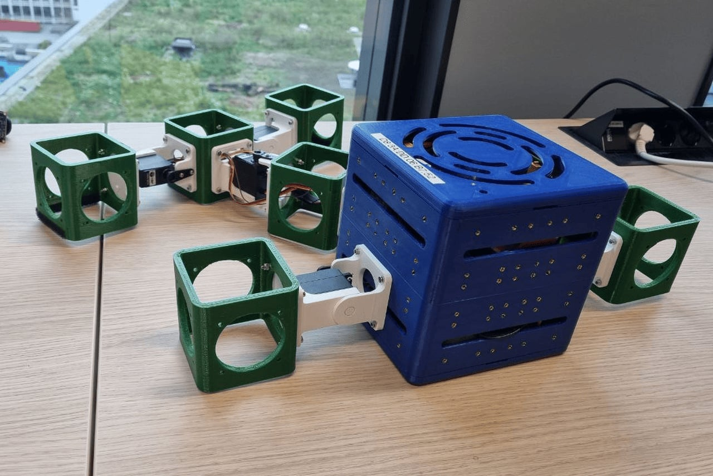
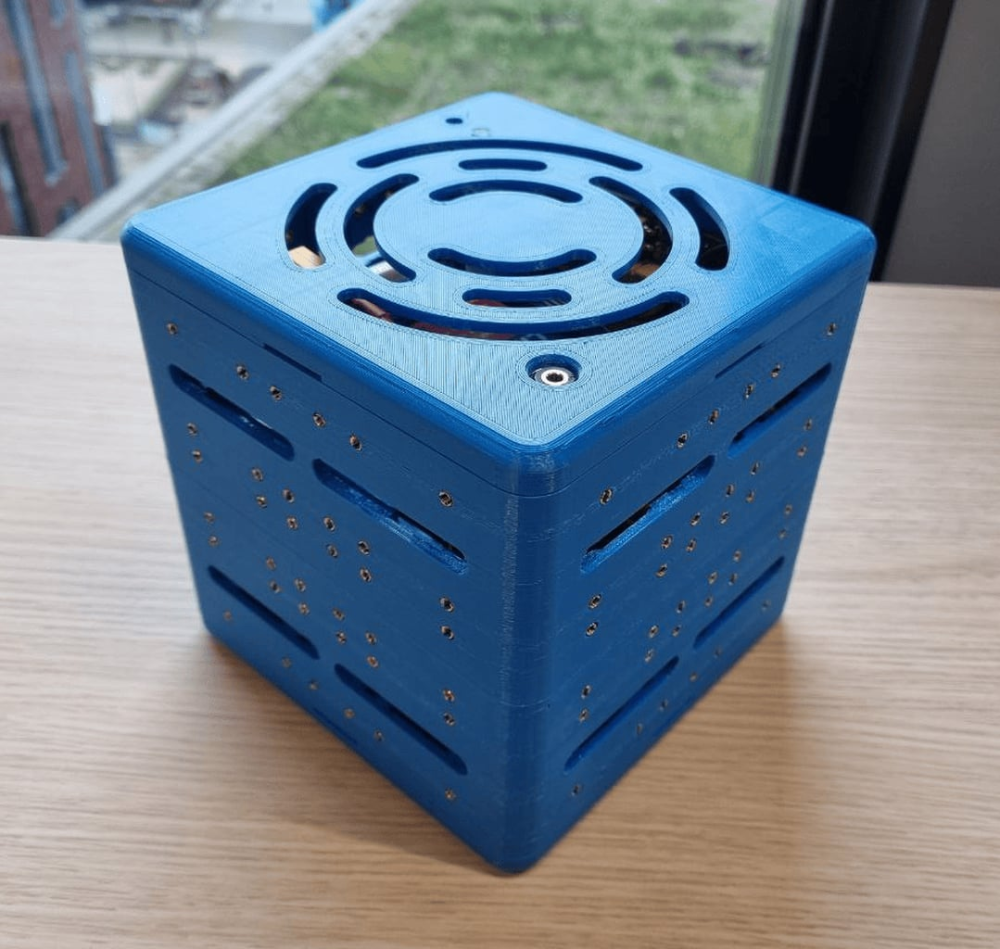
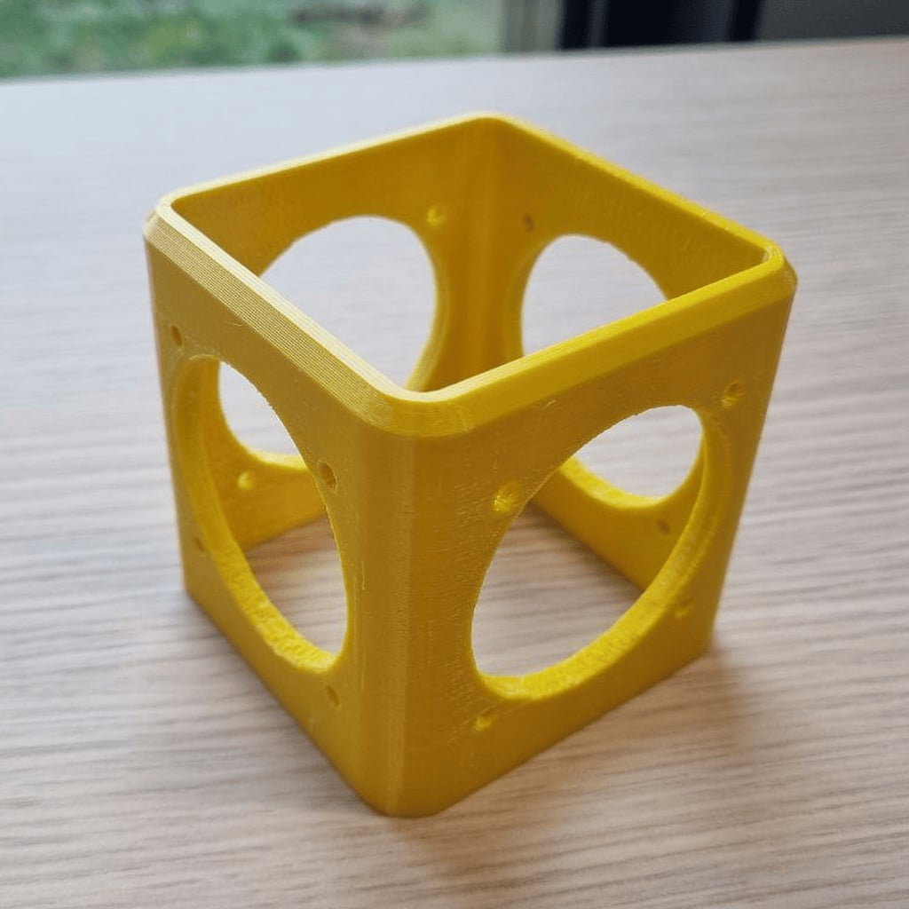
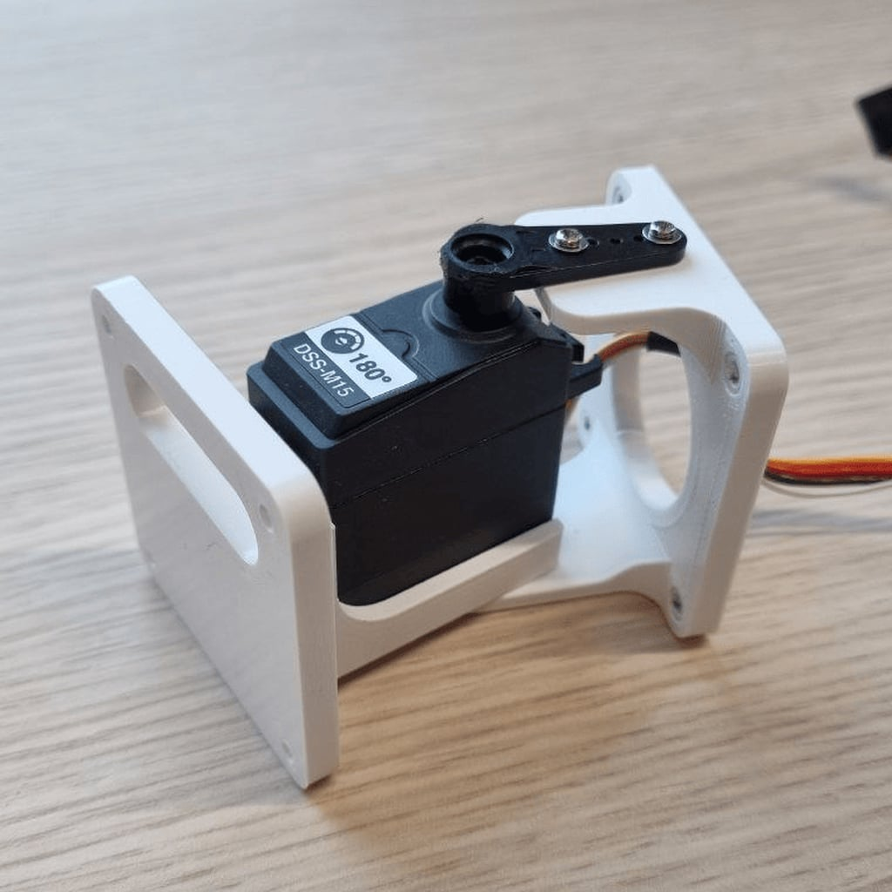

=================================
An introduction to modular robots
=================================
This introduction applies to V2 robots. V1 robots are only used internally in CI Group.

Modular robots are robots built from a set of modules and sensors.
A central brain controls the robot, which can read the sensors.
The modular robots system in ARIEL is based on the RoboGen system (*RoboGen: Robot Generation through Artificial Evolution, ser. Artificial Life Conference Proceedings, vol. ALIFE 14: The Fourteenth International Conference on the Synthesis and Simulation of Living Systems, 07 2014*).
It is possible to adjust ARIEL to include modules and sensors not readily available in the standard set.

-------
Modules
-------
At the center of the robot lies the core module, which contains the brain.

Other modules are attached to the core in its sides.
Brick are passive blocks to which again modules can be attached.

Active hinges are revolute joints that are controlled by the robot's brain.

-------
Sensors
-------
Currently the brain can read only the current position of each servo. This works both in simulation and real hardware.
